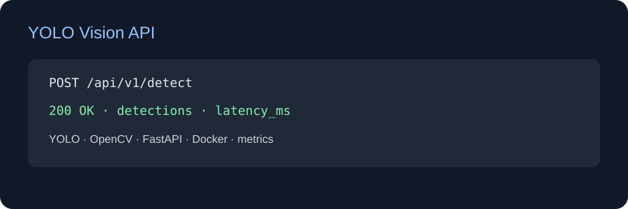

# YOLO Vision API

[English](README.md) | [Türkçe](README_TR.md) | [Deutsch](README_DE.md)

Produktionsnaher FastAPI-Service für YOLO-Bild- und Videoerkennung. Die API liefert Bounding Boxes, Klassen, Konfidenzen sowie Laufzeit- und FPS-Metriken.

## Funktionen
- Bild- und Video-Upload
- Annotierte Vorschau und JSON-Ergebnisse
- Preprocess-, Inference-, Postprocess- und Gesamt-Latenz
- Konfigurierbare .pt-Gewichte, Docker, Tests und CI

## Start

    cp .env.example .env
    pip install -e ".[inference,dev]"
    uvicorn app.main:app --reload --port 8001

Docker: docker compose up --build. Swagger: /docs.

Konfidenz und FPS sind Laufzeitmetriken, keine Genauigkeitsgarantie. Für mAP50-95 und Precision/Recall ist ein gelabelter Validierungsdatensatz erforderlich.

